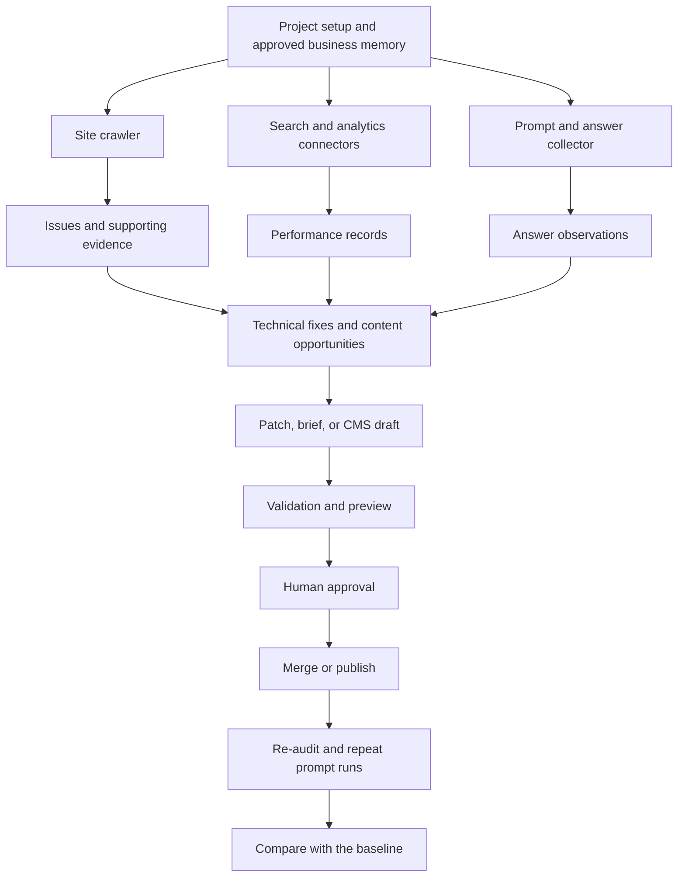

# AI search visibility research and product plan

Research date: 2026-09-26. This document consolidates the original research and follow-up notes into a product plan. It describes intended behavior, not implemented features.

The proposed app is an open-source workspace for measuring a business's visibility in AI search, finding technical and content issues, proposing evidence-backed changes, and measuring the results after publication. Users can access the hosted SaaS or deploy the app themselves.

The plan distinguishes decisions already recorded in the research from preferences that need a technical spike. The full feature set remains the intended direction. The smaller first release described below is a recommendation, not a finalized scope decision.

## 1. Problem

Business owners, marketers, and SEO leads need to understand how their businesses appear in generated answers from Google AI Overviews, Google AI Mode, ChatGPT Search, Copilot, Perplexity, and Claude.

They need answers to four practical questions:

- Can these systems access, index, and cite the site's content?
- Which customer questions mention the business, and which mention competitors instead?
- Which pages support those answers, and what should the business change?
- After a change, did visibility, traffic, or business outcomes improve?

The evidence is fragmented across webmaster tools, analytics, crawler results, and individual AI answers. A visibility score alone does not explain what happened or produce a reviewable fix.

### Product opportunity

The product's proposed advantage is the connection between evidence and changes to a real site. Each recommendation should lead to a pull request or CMS draft with supporting evidence, validation, human approval, and a way to reverse the change.

Open source, inspectable evidence, agent access, and a choice between hosted SaaS and self-hosting are central to this positioning. Competitor limitations should be treated as research hypotheses rather than blanket claims that every competing product lacks these capabilities.

The original research identified these products for comparison. Their current capabilities need a dedicated comparison before making public competitive claims.

| Product | Focus identified in the research | Implication for this product |
|---|---|---|
| Semrush AI Visibility | AI visibility reporting within an SEO suite | Make the evidence behind each result inspectable |
| Profound | AI visibility and content workflows | Focus on the technical audit, fix, and measurement loop |
| Okara.ai | Broad marketing agents and integrations | Keep connectors open and permissions explicit |
| By Default | Prompt tracking and content changes through Git | Make observation records and run settings exportable |
| Rank.ai | Buying-question monitoring and CMS publishing | Connect changes to technical checks and first-party outcomes |

### Research principles

Google's documentation says that pages must be indexed and eligible for snippets to appear as supporting links in its AI search features. It does not require special AI markup or new AI text files. The product should prioritize crawl access, internal links, useful visible content, accurate structured data, and page experience. Eligibility does not guarantee inclusion. See [AI features and your website](https://developers.google.com/search/docs/appearance/ai-features).

An AI answer is an observation from a particular run, not a stable search rank. API responses, consumer interfaces, and third-party collections must remain distinguishable. Repeated samples can describe variation, but a before-and-after comparison alone cannot prove that a site change caused a visibility change.

## 2. Solution

The app will support multiple business projects and connect measurement to an approved change workflow:

1. Collect site evidence, search performance, analytics, and sampled AI answers.
2. Audit the site with repeatable checks. Attach a URL, evidence, severity, confidence, proposed fix, and validation method to each issue.
3. Propose a focused code patch or CMS draft grounded in approved business information.
4. Validate the change and provide a preview for human review.
5. After approval and publication, repeat the relevant audits and prompt runs, then compare the results.

Users can work through the dashboard or connect their own agent through a remote Model Context Protocol server, referred to as MCP below. A CLI is planned later.

### Hosted SaaS and self-hosting

The product will be available as a hosted SaaS and as open-source software that users can deploy themselves. The SaaS manages infrastructure and the model and data-provider accounts needed to run the service. Customers connect their business tools, such as Search Console, GA4, GitHub, and their CMS, through the relevant authorization flows.

Self-hosters operate their own deployment, configure the API keys and service credentials required by their enabled integrations, and pay their infrastructure and provider bills directly. They control stored project data, while external API calls still send the necessary data to providers. The hosted SaaS must also explain where it stores data and which providers receive it.

The intended product guarantees are evidence attached to recommendations, inspectable run settings, exportable data, and human approval before merging or publishing. Repeating a run should reproduce its configuration and processing, not promise an identical answer from an external model.

## 3. Architecture

### End-to-end flow



### Core components

| Component | Responsibility |
|---|---|
| Core API | Project access, memory, evidence, observations, change proposals, and approval rules |
| Dashboard | Tables, filters, charts, evidence views, diffs, previews, and review queues |
| MCP server | Agent access to the same project data and operations |
| Connectors | Search, analytics, GitHub, CMS, model, and third-party data integrations |
| Job runner | Crawls, syncs, prompt batches, content generation, fixes, and follow-up checks |
| Isolated execution environment | Repository checkout, dependency installation, patching, builds, tests, and browser rendering |
| Postgres | Projects, versioned memory, issues, normalized observations, approvals, and job receipts |
| Object storage | Raw answers, crawl snapshots, and other large evidence artifacts |

The dashboard, MCP server, and later CLI use the same core operations. Authorization and approval rules belong in the backend so every client follows them.

### Project memory and evidence

Each project keeps versioned business information:

- Identity, positioning, audience, products, services, locations, and differentiators.
- Approved claims with a source URL, date, and owner, plus disallowed claims.
- Content inventory with URL, template, title, description, canonical URL, structured data, last-change date, target topics, and status.
- Prompt portfolio with question, intent, locale, target engine, model where known, priority, and competitors.
- Integration configuration and granted permissions.

Generated business claims must have internal evidence links to approved memory records or fetched sources. Unsupported statements require evidence or an explicit draft-assumption label before approval.

Each answer observation stores the prompt, timestamp, provider, collection method, location, language, device where relevant, and model version when available. It also records the raw answer, mentions, citations, available search queries, and parser confidence. Missing provider fields must remain unknown rather than inferred as facts.

### Remote MCP server

Remote MCP access is a recorded product decision. It lets users work with the app from compatible agent clients, while the server retains project permissions and approval controls. Compatibility with each intended client must be tested before it is promised.

Use one server with OAuth access granted per project. A tool takes a `project` argument, which may default to the sole authorized project. The server must still check project access on every call.

| Tool group | Planned tools |
|---|---|
| Read | `get_project_memory`, `list_issues`, `get_issue_evidence`, `query_search_performance`, `query_prompt_observations`, `get_page` |
| Propose changes | `propose_fix`, `propose_memory_update` |
| Start jobs | `run_audit`, `rerun_prompts` |

`propose_fix` creates a PR or CMS draft. `propose_memory_update` enters the review queue. Read access, proposal permissions, and permission to start metered jobs should be explicit. No tool bypasses approval to merge or publish.

MCP resources expose project memory. MCP prompts package tasks such as writing a brief from approved claims or fixing one issue class. Results include evidence and timestamps. Every call enters the same job-receipt ledger as dashboard work.

### Safe change execution

1. Classify issues by impact, confidence, affected URL, and template.
2. Generate a minimal patch or CMS draft for one issue class, with before-and-after evidence.
3. For code changes, create a branch and PR. Run the applicable tests, lint, build, HTML checks, structured-data checks, and link or canonical regression checks.
4. Deploy an isolated preview where supported. Show the rendered result, diff, and audit recheck.
5. After human approval, merge or publish. Use supported discovery mechanisms such as sitemap updates and IndexNow, then repeat the affected checks.

Content changes and code changes remain separately reviewable. The product must not invent prices, reviews, locations, credentials, or other business claims. Each proposal includes confidence, a rollback approach, and a visible job cost.

The fix runner executes untrusted repository code. It needs isolated execution, restricted network access, limited credentials, encrypted credential storage, and audit logs. Vercel Sandbox is the selected hosted environment; self-hosted execution needs an equivalent isolation boundary.

## 4. Features and shipping plan

### Intended feature set

| Feature | Intended behavior |
|---|---|
| Technical SEO crawler and issue graph | Check crawler access, indexability, snippet controls, sitemaps, canonical URLs, duplicates, internal links, orphan-page candidates, rendered content, page experience, and structured data against visible text |
| Search performance workspace | Connect verified Search Console sites; show page and query trends, sitemap information, and URL-level evidence |
| Analytics workspace | Query GA4 for users, views, landing pages, acquisition sources, key events, and engagement; preserve report definitions behind recommendations |
| Prompt and answer monitor | Manage prompt portfolios, schedule repeated samples, archive answers, track brand and competitor mentions, citations, mention position, sentiment, confidence, and trends |
| Content opportunity engine | Combine search queries and citation gaps into briefs and evidence-backed drafts, then send approved work to a CMS or GitHub |
| SEO Fix | Propose focused changes with a diff, evidence, checks, preview, approval, rollback, and follow-up audit |
| Agent access | Expose memory, evidence, proposals, and metered jobs through remote MCP |
| Cost visibility and exports | Show job receipts and provider usage; export records as CSV or JSON |

A crawl can identify orphan-page candidates only when it has another URL inventory to compare with discovered links. Likewise, a crawler can inspect indexability signals, but it cannot establish a search engine's actual indexing state from HTML alone.

The initial fix catalog includes missing or duplicate titles and descriptions, crawler-access problems, sitemap discovery, internal links, structured-data mismatches, canonical issues, and missing rendered text. The first release should implement only a small subset.

### Phased delivery

The original roadmap describes four phases:

| Phase | Scope |
|---|---|
| 1. Evidence and audit core | Project memory, crawler, issue graph, Search Console and GA4 reads, prompt runs with raw answers and citations, dashboard, exports, and initial MCP access |
| 2. Draft and approval loop | Opportunity briefs, grounded drafts, claim checks, review queue, GitHub PRs, Webflow staged items, and WordPress drafts |
| 3. Validated fixes | Template-aware patches, isolated tests and previews, approval policies, post-merge audits, and complete cost receipts |
| 4. Broader integrations | Shopify, additional CMSs, browser-agent usability checks, log-based attribution, more provider adapters, and a CLI with local execution |

MCP was described as a day-one feature elsewhere in the original research, so it is included explicitly in Phase 1 here. Service configuration and job metering must also exist when paid jobs first ship. The SaaS needs usage limits and billing for its initial offering, while self-hosters need configuration instructions for their own services. More billing options and provider integrations can follow later.

### Recommended first release

The complete Phase 1 is substantial for a side project. A smaller first release would prove the complete workflow with one site, approved project memory, a crawler, Search Console, one answer collector, basic MCP access, and GitHub fixes for two or three issue classes.

The release succeeds when a user can inspect an issue, review a generated PR with evidence and checks, approve it, and see the follow-up audit and sampled visibility results. GA4 dashboards, multiple CMS adapters, broad engine coverage, and advanced billing can then expand the same workflow.

The choice between a direct model API and DataForSEO for this first collector remains open. The preferred overall direction is DataForSEO, while a direct API may reduce the initial integration work. Either choice must label the collection method.

## 5. Tech stack and external services

### Stack overview

| Layer | Direction in the research | Status |
|---|---|---|
| Web app | TypeScript, React, TanStack Start, Router, Query, and Table; Vite development tooling | TanStack Start selected |
| Backend | Effect v4 for schemas, services, errors, retries, and bounded concurrency | Preferred; validate with a spike |
| REST API | Effect HttpApi with OpenAPI and a typed client | Depends on the Effect spike |
| MCP transport | Effect McpServer over Streamable HTTP with OAuth | OAuth and deployment behavior unverified |
| Backend fallback | Hono, Zod, and the official MCP SDK through `mcp-handler` | Fallback if the preferred integration is unsuitable |
| Database | Postgres, initially Neon; Supabase is another option | Postgres selected; provider proposed |
| Object storage | Vercel Blob or Cloudflare R2 | Provider open |
| Durable jobs | Vercel Workflow SDK, with Queues and Cron as needed | Hosted direction |
| Isolated execution | Vercel Sandbox | Hosted selection |
| Browser rendering | Playwright in Sandbox or a hosted browser service | Implementation open |
| Authentication | Better Auth was mentioned as a candidate | Not selected; app login and MCP OAuth both need a design |
| Marketing and docs | Separate site using Astro or Fumadocs | Later choice |
| Self-hosting | Node deployment and Docker Compose, with replaceable infrastructure adapters | Required design goal; needs deployment validation |
| CLI | Shared API client, potentially `effect/unstable/cli`, with a local execution mode | Later |

### TanStack Start

The app is primarily an authenticated dashboard with tables, filters, charts, and diffs. TanStack Start is the recorded choice because its router, query tools, and table tools fit that workload. Typed URL parameters make filtered views shareable.

Vercel documents [TanStack Start deployment support](https://vercel.com/docs/frameworks/full-stack/tanstack-start). Validate the selected version's Node deployment path before treating the Docker build as complete. The original research's Nitro-specific build description should not be a permanent architectural assumption.

The trade-offs are framework maturity, ecosystem size, contributor familiarity, and integration maintenance. Keep the core packages independent of the app framework. A separate marketing site can address public search and documentation needs.

### Effect backend

Effect is preferred for typed failures, provider adapters, retries, bounded concurrency, cancellation, schemas, and resource cleanup. These capabilities match the integration-heavy backend. See [Effect's onboarding documentation](https://effect.website/docs/v4/onboarding).

Each integration would be a Service with a Layer. Alternative providers, test implementations, and self-hosted adapters would supply different Layers. Shared schemas would define core records and validate API and MCP inputs.

The original notes describe v4 as a release candidate and refer to `effect/unstable/httpapi`, `ai`, `sql`, `workflow`, and `cli`. Confirm the exact release and module APIs during the spike rather than relying on those notes. Pin the selected versions.

The proposed package layout is:

```text
packages/core          Shared schemas, memory, observations, issues, and policies
packages/integrations  Provider services, adapters, authentication, and retries
packages/jobs          Crawl, prompt, draft, and fix programs
packages/api           REST endpoints and MCP tools over shared operations
apps/web               TanStack Start dashboard and server-route integration
apps/cli               Later API client and local execution mode
```

React components remain plain React and TanStack code. Vercel Workflow handles durable orchestration and calls Effect programs within steps. Effect tracing can supply operational context, but the app must persist its own job and cost receipts.

The proposed one- to two-day spike should deploy one MCP tool through a TanStack Start route on Vercel. Test OAuth, project authorization, streaming, and connections from the intended clients. If Effect's MCP integration is unsuitable, retain Effect in the core and jobs while using the official MCP SDK for transport. Hono and Zod remain the broader fallback.

### Vercel deployment

```text
TanStack Start on Vercel
    Dashboard + REST API + /mcp endpoint
    |
    +-- Postgres                 Projects, memory, issues, observations, receipts
    +-- Blob or R2               Raw answers and crawl snapshots
    +-- Workflow                 Durable job orchestration
    +-- Queues                   Job delivery and bounded fan-out where needed
    +-- Cron                     Scheduled syncs, audits, and prompt runs
    +-- Sandbox                  Isolated repo work and browser execution
    +-- External connectors      Search, analytics, GitHub, CMSs, and providers
```

Workflow uses Queues internally. Application-level queues are a separate design choice, not automatically another required orchestration layer. Workflow steps still have function limits, so long builds and browser sessions belong in the execution environment. See [Workflow pricing and limits](https://vercel.com/docs/workflows/pricing).

Keep storage, execution, and durable-job interfaces replaceable. A Docker Compose deployment also needs working implementations of those services; a containerized web app alone does not satisfy self-hosting.

Cloudflare was considered for Workers, Agents SDK, Durable Objects, Browser Rendering, and R2. The research favors Vercel for the intended Node-based application and isolated build workflow. Cloudflare remains an alternative to evaluate against actual runtime and portability requirements, without assuming it is always cheaper.

### Search, analytics, and publishing services

| Service | Planned role and boundary |
|---|---|
| Google Search Console | Site list, Search Analytics, and sitemap data. Use read access for dashboards and separately authorized write access for sitemap actions |
| GA4 Data API | Standard, realtime, batch, and metadata queries. Save the query definition with its results |
| Bing Webmaster Tools | First-party AI citation evidence. Confirm export and API availability before implementing automatic ingestion |
| IndexNow | Notify participating search engines after approved publication; notification does not guarantee indexing |
| GitHub App | Selected-repository access, short-lived installation tokens, PR creation, and post-merge webhooks |
| Webflow | OAuth connection and staged CMS items, followed by approved publication. Broader page and site settings come later |
| WordPress | REST API drafts, with an authentication method suitable for the deployment, such as Application Passwords or a narrowly scoped plugin |
| Shopify | GraphQL Admin API adapter in a later phase, with rate-limit handling |
| CrUX | Page-experience field data where coverage exists |
| Lighthouse and PageSpeed Insights | Performance diagnostics; distinguish lab measurements from field data |
| schema.org and Google structured-data guidance | Validate markup and check that claims match visible content |
| Cloudflare, Vercel, and server logs | Later ingestion for observed bot requests and AI referrals |
| Model providers | Generation and optional direct answer collection through SaaS-managed accounts or credentials configured by self-hosters |

Google's [Search Generative AI report announcement](https://developers.google.com/search/blog/2026/06/gen-ai-performance-reports) confirms dedicated impression reporting and a global rollout by August 31, 2026. Plan for manual import where an appropriate export exists until the required API support is verified. These reports do not replace raw answers or competitor observations.

Bing's [AI visibility update](https://blogs.bing.com/search/2026/6/New-AI-Visibility-Insights-in-Bing-Webmaster-Tools-Intents-Topics-Citation-Share-Compare/) adds intent, topic, citation-share, and comparison views. Preserve its coverage and sampling limitations when presenting imported data.

### DataForSEO

DataForSEO is the preferred third-party collector, subject to endpoint, pricing, and licensing validation. It supplements first-party measurements with sampled answers and competitor data.

| API family identified in the research | Intended use in the product |
|---|---|
| LLM Scraper | Collect supported consumer-interface answers, citations, and available query metadata |
| Google AI Mode SERP and Organic SERP | Observe AI Mode and AI Overview results where returned |
| LLM Responses | Collect API responses from supported model providers, labeled separately from interface observations |
| LLM Mentions and AI Keyword Data | Suggest prompts and identify existing brand or competitor mentions; label estimated volumes |
| Labs and Keywords Data | Find competitor keywords and topic gaps |
| Backlinks | Later research into relevant referring domains |
| Business Data and Merchant | Later local-business and commerce workflows |
| On-Page | Evaluated but not selected; the built-in crawler remains a core component |

Endpoint capabilities, model metadata, locale coverage, and optional fields need contract checks during integration. The original research flags US-English limits for ChatGPT data in LLM Mentions. Do not apply one endpoint's coverage to the whole service. Start from the [AI Optimization API documentation](https://docs.dataforseo.com/v3/ai_optimization-overview/).

Place the adapter behind `AnswerCollector` and `SerpProvider` interfaces. Direct APIs, SerpApi, or Bright Data could provide alternatives later. Each observation retains its collection method, such as `dfs_llm_scraper`, `dfs_ai_mode`, or `llm_api`.

Use asynchronous collection where its latency fits scheduled monitoring. A provider callback can resume the relevant job after the app validates and associates the callback with its task. The app's MCP tools expose normalized records; users who need raw provider operations can connect DataForSEO's own MCP server separately.

A domain-only introductory report is a proposed onboarding feature. It could show sampled mentions and competitors before users connect Search Console or GitHub. A free version needs an explicit provider budget.

The hosted SaaS will manage and pay for its DataForSEO account. Self-hosters configure their own account and credentials. Confirm the provider-data rights required for the hosted offering before launch. Do not treat scraping as a complete representation of every user's experience.

### Rough costs and metering

The main cost drivers are answer collection, browser rendering, repository builds, durable jobs, and retained evidence. MCP versus CLI is mainly an access choice. Local execution moves compute costs to the user's machine; it does not remove provider charges.

The original workload example is useful:

```text
50 prompts x 3 engines x 3 samples x 30 days = 13,500 runs per project per month
13,500 answers x 10 KB per answer = about 135 MB of raw answer text per month
```

The storage figure excludes snapshots, indexes, metadata, logs, and backups. Engine-specific collection prices, retries, and extra samples affect the run budget.

| Item | Planning estimate or verified billing basis |
|---|---|
| DataForSEO answer collection | Original estimate: $0.0012 to $0.004 per run, or $16.20 to $54 for 13,500 runs. Treat this as a scenario until each selected endpoint and queue price is checked |
| Direct model APIs | Original allowance: roughly $100 to $500 per project per month at that workload. Recalculate from model, search-tool, token, and retry charges |
| Early hosted infrastructure | Original infrastructure-only estimate: $25 to $50 per month for about ten lightly used projects, excluding model and data-provider usage. The SaaS must budget for those charges as well. This estimate remains unvalidated |
| Workflow | $20 per million events, $0.50 per GB written, and $0.50 per GB-month retained, plus queue and function usage |
| Queues | Region-dependent operation charges; message size and delivery behavior affect billable units |
| Sandbox | Example `iad1` rates: $0.128 per active CPU-hour, $0.0212 per GB-hour of memory, and $0.60 per million creations; transfer and storage add charges |
| Database and object storage | Provider plan, operations, retention, backups, and transfer determine cost |

The verified Vercel figures come from [Workflow pricing](https://vercel.com/docs/workflows/pricing), [Queues pricing](https://vercel.com/docs/queues/pricing), and [Sandbox pricing](https://vercel.com/docs/sandbox/pricing). Recheck [Vercel plan pricing](https://vercel.com/pricing) and [DataForSEO pricing](https://dataforseo.com/pricing/ai-optimization/llm-scraper) before setting a hosted price.

Do not budget around grants. The original notes identify the Vercel OSS Program and Startups Program as possible support, but award amounts, eligibility, application availability, and permitted use need confirmation.

Meter crawl batches, sync windows, analytics queries, prompt runs, briefs, drafts, validation runs, patches, previews, publication actions, and follow-up checks. For the SaaS, track underlying infrastructure and provider costs separately from customer-facing usage and billing. Pricing must account for both. Self-hosted deployments use metering for cost visibility and budgets, with their operators paying external services directly. Whether the SaaS uses subscriptions, credits, usage-based pricing, or a combination remains open.

## 6. Open decisions and research follow-up

| Question | What remains to resolve |
|---|---|
| First release | Approve the smaller complete workflow or retain the broader Phase 1 |
| Effect and MCP | Verify the selected release, module stability, OAuth implementation, streaming, and client compatibility |
| Authentication | Select the app authentication system and define project-scoped MCP authorization |
| Self-hosting | Choose durable-job, object-storage, and isolated-execution adapters and test the complete deployment |
| Answer collector | Pick the first provider, supported engines, locales, sample counts, and monthly budget |
| First-party AI data | Verify available exports, API coverage, and automated collection permissions |
| Crawler controls | Maintain separate policies for retrieval, training, and user-requested fetching; verify vendor-specific behavior against current documentation |
| Search controls | Verify the original claim about a separate Search Console generative-AI opt-out before adding a product check for it |
| Measurement | Define comparable baselines, sample-size reporting, confidence intervals, and the treatment of model changes |
| Billing and licensing | Choose the SaaS pricing model, included usage, and limits; confirm provider-data rights and the budget for any free public report |

Proofreading changes include removing repeated sections and the accumulated `[added]` labels, expanding ambiguous terminology, and distinguishing decisions from proposals. Unverified price details, framework-version claims, crawler-policy specifics, and the unsourced numerical API-versus-interface comparison are no longer stated as settled facts. The original version remains available in Git.

## 7. Sources

The original source list is retained for follow-up research. Inline citations identify sources used for the targeted checks in this revision; the full list has not been reverified.

- Google: [AI optimization guide](https://developers.google.com/search/docs/fundamentals/ai-optimization-guide), [AI features and your website](https://developers.google.com/search/docs/appearance/ai-features), [Search Console API](https://developers.google.com/webmaster-tools), [GA4 Data API](https://developers.google.com/analytics/devguides/reporting/data/v1), [Structured data intro](https://developers.google.com/search/docs/appearance/structured-data/intro-structured-data)
- Google Search Generative AI report: [launch post](https://developers.google.com/search/blog/2026/06/gen-ai-performance-reports), [help page](https://support.google.com/webmasters/answer/16984139?hl=en), [global rollout](https://searchengineland.com/google-search-console-ai-performance-reports-and-search-generative-ai-control-rolling-out-globally-486269)
- Bing: [AI Performance help](https://www.bing.com/webmasters/help/ai-performance-9f8e7d6c), [launch post](https://blogs.bing.com/webmaster/February-2026/Introducing-AI-Performance-in-Bing-Webmaster-Tools-Public-Preview), [June 2026 expansion](https://blogs.bing.com/search/2026/6/New-AI-Visibility-Insights-in-Bing-Webmaster-Tools-Intents-Topics-Citation-Share-Compare), [no API yet (SEJ)](https://www.searchenginejournal.com/bing-webmaster-tools-adds-ai-citation-performance-data/566874/)
- Crawlers: [OpenAI bots](https://developers.openai.com/api/docs/bots), [Anthropic crawlers](https://support.anthropic.com/en/articles/8896518), [Perplexity crawlers](https://docs.perplexity.ai/docs/resources/perplexity-crawlers), [Perplexity stealth crawling report](https://www.malwarebytes.com/blog/news/2025/08/perplexity-ai-ignores-no-crawling-rules-on-websites-crawls-them-anyway)
- API vs scraping: [Conductor](https://www.conductor.com/academy/scraping-vs-api/), [seoClarity](https://www.seoclarity.net/blog/scraping-vs.-api)
- Platforms: [GitHub App auth](https://docs.github.com/en/apps/creating-github-apps/authenticating-with-a-github-app/authenticating-as-a-github-app-installation), [Authorizing GitHub Apps](https://docs.github.com/en/apps/using-github-apps/authorizing-github-apps), [Webflow](https://developers.webflow.com/), [Webflow CMS](https://developers.webflow.com/data/docs/working-with-the-cms), [WordPress REST](https://developer.wordpress.org/rest-api/), [WP App Passwords](https://developer.wordpress.org/advanced-administration/security/application-passwords/), [Shopify Admin REST](https://shopify.dev/docs/api/admin-rest)
- Hosting: [Vercel pricing](https://vercel.com/pricing), [Fluid compute pricing](https://vercel.com/docs/functions/usage-and-pricing), [Functions limits](https://vercel.com/docs/functions/limitations), [Workflow pricing](https://vercel.com/docs/workflows/pricing), [Queues pricing](https://vercel.com/docs/queues/pricing), [Sandbox pricing](https://vercel.com/docs/sandbox/pricing), [Vercel OSS Program](https://vercel.com/open-source-program), [Cloudflare Workers pricing](https://developers.cloudflare.com/workers/platform/pricing/), [Cloudflare Browser Rendering pricing](https://developers.cloudflare.com/changelog/2025-07-28-br-pricing/)
- Stack: [TanStack Start on Vercel](https://vercel.com/docs/frameworks/full-stack/tanstack-start), [TanStack Start hosting](https://tanstack.com/start/latest/docs/framework/react/guide/hosting), [Workflow SDK supports TanStack Start](https://vercel.com/changelog/workflow-sdk-now-supports-tanstack-start), [Deploy MCP servers to Vercel](https://vercel.com/docs/mcp/deploy-mcp-servers-to-vercel), [Effect v4 onboarding](https://effect.website/docs/v4/onboarding), [Effect v4 Beta](https://effect.website/blog/releases/effect/40-beta), [Effect v4 Feb–May recap](https://effect.website/blog/effect-v4beta-launch-to-may-recap), [InfoQ: Effect v4](https://www.infoq.com/news/2026/04/effect-v4-beta/), [v4 migration guide](https://github.com/Effect-TS/effect-smol/blob/main/MIGRATION.md), [McpServer instructions issue](https://github.com/Effect-TS/effect/issues/8219)
- DataForSEO: [homepage](https://dataforseo.com/), [AI Optimization API](https://dataforseo.com/apis/ai-optimization-api), [AI Optimization docs](https://docs.dataforseo.com/v3/ai_optimization-overview/), [ChatGPT LLM Scraper docs](https://docs.dataforseo.com/v3/ai_optimization-chat_gpt-llm_scraper-live-advanced/), [LLM Mentions docs](https://docs.dataforseo.com/v3/ai_optimization-llm_mentions-search-live/), [AI Mode docs](https://docs.dataforseo.com/v3/serp-google-ai_mode-live-advanced/); pricing: [LLM Scraper](https://dataforseo.com/pricing/ai-optimization/llm-scraper), [LLM Responses](https://dataforseo.com/pricing/ai-optimization/llm-responses), [LLM Mentions](https://dataforseo.com/pricing/ai-optimization/llm-mentions), [AI Mode](https://dataforseo.com/pricing/google-serp/google-ai-mode-serp-api), [On-Page](https://dataforseo.com/pricing/on-page), [Labs](https://dataforseo.com/pricing/dataforseo-labs/dataforseo-google-api), [Backlinks](https://dataforseo.com/pricing/backlinks/backlinks), [July 2026 pricing update](https://dataforseo.com/update/pricing-update-in-dataforseo-apis), [Terms of Service](https://dataforseo.com/terms-of-service), [official MCP server](https://github.com/dataforseo/mcp-server-typescript); third-party price references: [NextGrowth SERP](https://nextgrowth.ai/dataforseo-serp-api/), [NextGrowth On-Page](https://nextgrowth.ai/dataforseo-on-page-api/), [ContextBolt MCP setup](https://contextbolt.com/blog/dataforseo-mcp-setup/)
- Competitors: [Semrush](https://www.semrush.com/kb/1493-ai-visibility-toolkit), [Profound](https://www.tryprofound.com/), [Okara](https://www.okara.ai/), [By Default](https://www.bydefault.so/), [Rank.ai](https://rank.ai/)
