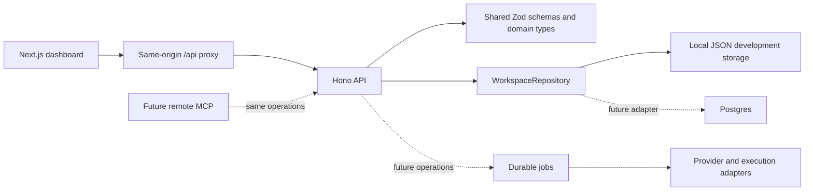

# Foundation architecture

The implementation follows the product flow in `ai-visibility-research.md` while using the user-selected Next.js frontend and Hono TypeScript backend.

## Implemented operations

Projects, memory versions, prompts, and local activity share a repository boundary. The API validates inputs with schemas also exported to the frontend. Memory updates append versions; old versions remain inspectable and exportable. Claims store a source URL, owner, and approval timestamp entered by the local user. These fields document approval in this development workflow; source verification and authenticated approval are later work.

The JSON adapter serializes writes within one process and commits via temporary-file rename. It is convenient for development, not a multi-process or hosted database. Repository corruption fails explicitly rather than silently replacing data. API tests use separate temporary stores.

The web app proxies `/api` to Hono. Provider secrets will remain on the backend. Future dashboard, MCP, and CLI clients must call the same authorized operations; backend policies must enforce project access, budgets, and publishing approval.

## Research requirements represented in the model

- Issues carry a URL, severity, confidence, supporting evidence IDs, proposed fix, and validation method.
- Observations retain timestamp, provider, collection method, raw answer reference, citations, mentions, parser confidence, and nullable model / location / language / device fields. Missing metadata is unknown.
- Proposals require a rollback path and retain approval identity and time.
- Job receipts distinguish lifecycle, completion time, and cost. Unknown cost is nullable rather than assumed free.
- Answer collection, object storage, publishing, durable jobs, and isolated execution have replaceable interfaces.

## Next milestones

1. Implement the Postgres repository and migration runner. MongoDB authentication and per-account isolation are implemented; team membership and per-project sharing remain to be designed before hosted access.
2. Implement a bounded crawler for access, titles, descriptions, and canonical checks. Block private-network destinations and DNS rebinding; do not equate crawl indexability with actual search-engine indexing.
3. Connect read-only Search Console and choose the first answer collector. Persist raw artifacts, run configuration, repeated samples, provider usage, and job receipts.
4. Add remote MCP through the official SDK, Streamable HTTP, OAuth, project scopes, and explicit permission for metered jobs. Validate client compatibility.
5. Add GitHub draft PR proposals for two or three issue classes, isolated tests and previews, human approval, rollback, and follow-up measurement.
6. Extend to GA4, CMS drafts, SaaS billing, and complete self-hosted infrastructure adapters.

Authentication now uses Better Auth, MongoDB, and Google OAuth. Business project persistence still uses per-account JSON repositories. Collector selection, deployment services, job orchestration, team access, and billing remain open decisions. The base does not choose an external paid provider or claim compatibility with agent clients.
